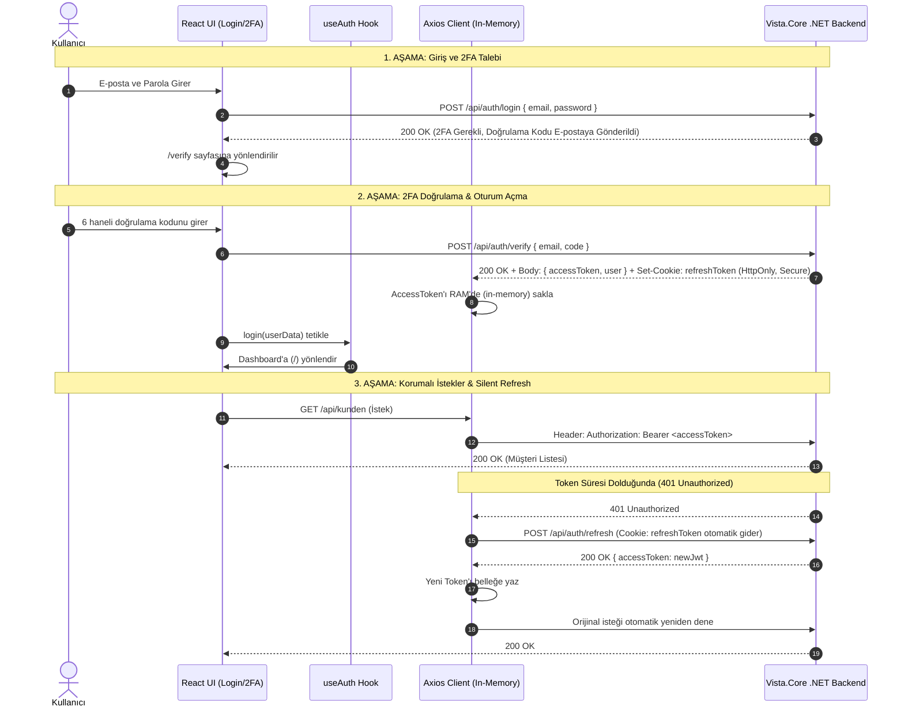

# 🔐 Vista.CoreX — Authentication & Authorization Flow

Bu doküman, Vista.CoreX (Saas.CoreX) frontend uygulamasının kimlik doğrulama (Authentication), iki aşamalı doğrulama (2FA), oturum devamlılığı (Silent Refresh), yetkilendirme (Role-Based Access Control - RBAC) ve güvenli token mimarisini açıklar.

---

## 1. Genel Akış Şeması (End-to-End)



---

## 2. Token Güvenliği & Bellek Yönetimi (OWASP Uyumlu)

* **Access Token (Kısa Ömürlü JWT - örn. 15 dk):**
  * `localStorage` veya `sessionStorage` içinde **saklanmaz**. Bu sayede olası XSS açıklarında kötü niyetli script'lerin token'ı çalması engellenir.
  * Sadece React çalışma zamanı belleğinde (`_accessToken` değişkeninde) tutulur.
* **Refresh Token (Uzun Ömürlü - örn. 7 gün):**
  * Backend tarafından `HttpOnly`, `Secure`, `SameSite=Strict` cookie olarak tarayıcıya iletilir.
  * JavaScript tarafından okunamaz veya manipüle edilemez.
* **Silent Refresh:**
  * Tarayıcı yenilendiğinde (F5) veya access token süresi dolduğunda (401), Axios interceptor'ı otomatik olarak `/api/auth/refresh` çağrısı yaparak oturumu kullanıcıya hissettirmeden yeniler.

---

## 3. Bileşenler & Mimari Görevler

### 3.1 `useAuth` Hook (`src/hooks/useAuth.jsx`)
* **State Yönetimi:** `user`, `isLoading`, `isAuthenticated` durumlarını React Context üzerinden tüm ağaca dağıtır.
* **Oturum Başlatma (Init):** Uygulama ilk açıldığında arka planda `/api/auth/me` çağrısı yaparak aktif bir oturumun (HttpOnly cookie) olup olmadığını sorgular.
* **Profil Zenginleştirme (`enrichProfile`):** Eksik alanlar (profil fotoğrafı, şube bilgisi vb.) varsa `/api/benutzer/{id}` üzerinden tamamlar.

### 3.2 `ProtectedRoute` (`src/components/shared/ProtectedRoute.jsx`)
* **Oturum Kontrolü:** Kullanıcı oturum açmamışsa (`isAuthenticated === false`) doğrudan `/login` sayfasına yönlendirir.
* **Yükleme Ekranı:** Oturum kontrolü devam ederken (`isLoading === true`) `LoadingSpinner` göstererek sayfa sıçramalarını (flicker) önler.
* **Rol Bazlı Yetkilendirme (RBAC):** Rota için `allowedRoles` tanımlanmışsa (örn: `['SuperAdmin', 'Admin']`), kullanıcının rolünü kontrol eder. Yetkisiz ise erişimi engeller.

```jsx
// Örnek: Rol Korumalı Rota (App.jsx)
<Route path="benutzer" element={
  <ProtectedRoute allowedRoles={['SuperAdmin', 'Admin', 'Manager']}>
    <Benutzer />
  </ProtectedRoute>
} />
```

### 3.3 Çok Kiracılı Mimari (`X-Mandant-Id`)
* Her API isteğinde JWT claim'inden çözümlenen `MandantId` değeri `X-Mandant-Id` HTTP başlığı olarak eklenir.
* Backend, tenant izolasyonunu bu başlık ve doğrulanmış token claims üzerinden garanti altına alır.
